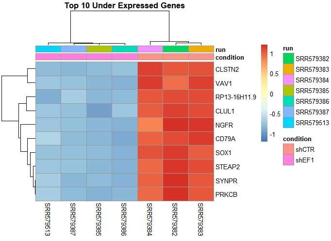
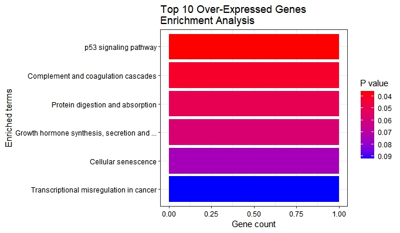
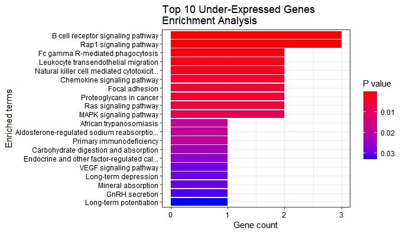

```{r setup, include=FALSE}
knitr::opts_chunk$set(echo = TRUE)
# Get the directory of the current script
script_dir <- dirname(rstudioapi::getActiveDocumentContext()$path)
# Set the working directory to the script's directory
setwd(script_dir)
library(knitr)
```

Running codes on RMarkdown was not only excruciatingly slow,
but also was turning my laptop into a frying pan.

The analysis was done in R, and the images were loaded using knitr.
The tables of results were saved in csv files and were loaded.

## PCA plot

```{r, echo=FALSE, out.width="800px"}

```


## MA plot
used normalized result (type == "normal")

```{r, echo=FALSE, out.width="800px"}

```


## DEG table
only top 6 rows
```{r, echo=FALSE}
kable(head(read.csv("results.csv")))
```

## Volcano plot

```{r, echo=FALSE, out.width="800px"}

```


## Pheatmap
### Top 10 over-expressed genes

```{r, echo=FALSE, out.width="800px"}


```


### Top 10 under-expressed genes

```{r, echo=FALSE, out.width="800px"}


```


## Enrichment analysis

### Top 10 over-expressed genes
```{r, echo=FALSE, out.width="800px"}


```


```{r, echo=FALSE}
kable(read.csv("10OverEnrichR.csv"))

```


### Top 10 under-expressed genes

```{r, echo=FALSE, out.width="800px"}


```

```{r, echo=FALSE}
kable(read.csv("10UnderEnrichR.csv"))
```
